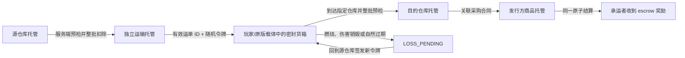

# 实体物流资产生命周期

实体物流的原则是：货物在任意时刻只能存在于仓库托管、运输托管或目的托管之一。密封货箱是访问凭证，不是商品容器；NBT 中的标签和数量只用于显示。

## 状态与资产位置

| 运单状态 | 权威商品位置 | 允许操作 | 幂等与回滚 |
| --- | --- | --- | --- |
| `IN_TRANSIT` | `TransportCustodyManager` | 在指定目标卸货；有效承运者运输 | 装货操作键全服有界保存；重复卸货因状态和令牌失败 |
| `LOSS_PENDING` | 运输托管 | 创建者/承运者在源仓库恢复 | 新货箱轮换随机令牌，旧件及创造复制件失效 |
| `DELIVERED` | 目的仓库或合同发行方托管 | 只读历史 | 运输托管已释放，任何副本均不能再次交付 |
| `QUARANTINED` | 保留原运输托管记录 | 管理员诊断 | 不猜测哪一份数量正确；物流模块暂停新写入 |
| `CANCELLED` | 不得存在运输托管 | 只读历史 | 首版不允许远程取消运输中货物 |

装货顺序为“校验 → 从源托管扣除 → 建立运单与运输托管”。创建内存记录失败会把商品完整补回源托管。卸货顺序为“校验目标容量 → 加入目的托管 → 可选合同原子结算 → 运单完成 → 释放运输托管”。任何可预期失败都会保留运输托管，不做部分卸货。

## 游戏内流程

1. 使用铁粒、线、纸和木桶制作密封运输货箱；仓库 Advancement 会解锁配方。
2. 用空货箱右键目的仓库，保存目标意图。
3. 前往另一座源仓库，副手拿一组已注册商品。副手堆叠数量是请求数量，服务端仍以仓库托管和等级吞吐为准。
4. 用已绑定货箱右键源仓库。成功后源托管减少，运输托管增加，货箱写入运单 ID、随机令牌版本和纯显示标签。
5. 玩家可把单个货箱放在背包、箱子矿车或原版带库存载体中实际运输。货箱禁止放入潜影盒等嵌套容器。
6. 在指定仓库右键卸货。成功后货箱回到可重复使用的空箱；若匹配已接受的同商品、同数量采购合同，则商品和 escrow 同时结算。

潜行对空气使用未装货箱可清除目的绑定。货箱损毁或物品实体自然过期后，回到源仓库使用空箱可恢复最早一份自己的丢失运单。

## 载体支持边界

| 载体 | 首版状态 | 行为 |
| --- | --- | --- |
| 玩家背包 | 完整支持 | 死亡按原版掉落；物品未销毁则运单不变 |
| 箱子矿车 | 支持 | 使用原版容器保存物品；破坏后按原版掉落，不扫描实体 |
| 带箱子的驴/骡、运输船/竹筏 | 被动物/船库存自然支持 | 不绑定或追踪实体；只认最终持有的有效货箱 |
| 潜影盒、嵌套容器 | 禁止 | `canFitInsideContainerItems=false`，降低嵌套复制与扫描风险 |
| 自动卡车、路径网络、跨维度无线仓库 | 不支持 | 不寻路、不强加载区块、不瞬移商品 |

跨维度只允许玩家或原版载体通过原版世界移动货箱；卸货仍要求本人位于目标维度和目标仓库附近。

## 公司物流权限

| 角色 | 查看自己的运单 | 装卸既有公司货物 | 创建公司运单 | 远程召回运输中商品 |
| --- | --- | --- | --- | --- |
| 所有者 | 是 | 是 | 是 | 否 |
| 经理/物流经理权限 | 是 | 是 | 是 | 否 |
| 仓库员工 | 与本人相关 | 是 | 否 | 否 |
| 普通成员 | 与本人相关 | 否 | 否 | 否 |
| 管理员 | 是 | 是 | 是 | 仅诊断，不直接复制资产 |

离开公司不会改变运输托管归属。原承运者仍可把已经领取的货箱交到运单指定的同公司仓库，但不能改目标或提取成个人商品。公司进入破产风险状态后禁止创建新运单，运输中托管不会被删除。

## 边界、性能与恢复

- 默认每玩家 8、每公司 32 个活跃运单；单箱最多 1,024 单位且受仓库等级单次吞吐限制。服务器配置可在安全范围内调整。
- 全服最多保存 2,048 条运单和 4,096 个装货幂等键；无资产终态历史最多保留 512 条。持有运输托管的记录永不因历史清理删除。
- 仓库菜单最多同步 64 条与玩家相关的运单，点击合同标题切换视图并滚动分页；普通成员看不到无关私人路线或坐标。
- 日常运行不扫描箱子、实体、区块或全世界坐标。只有装货、卸货、物品损毁/过期及存档时访问对应记录。
- 存档子根为 `Logistics`，版本 1。读档会验证仓库、商品、运单、运输托管和终态关系。坏数据保留可识别托管并把运单隔离，随后暂停物流写入。

## 尚需真人验收

仍需两名真人在专服中分别通过背包和箱子矿车完成远距离运输，并目视验证死亡掉落、火焰/虚空、服务器重启、退出公司及 GUI Scale 2～4。自动化测试覆盖资产守恒、重复请求、伪造显示 NBT、满仓拒绝、损毁恢复、存档一致性和合同 escrow，但不能替代载体手感与视觉验收。
